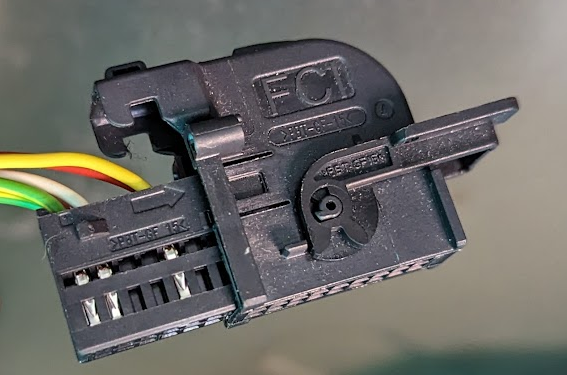
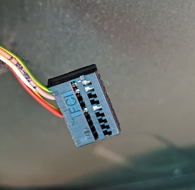
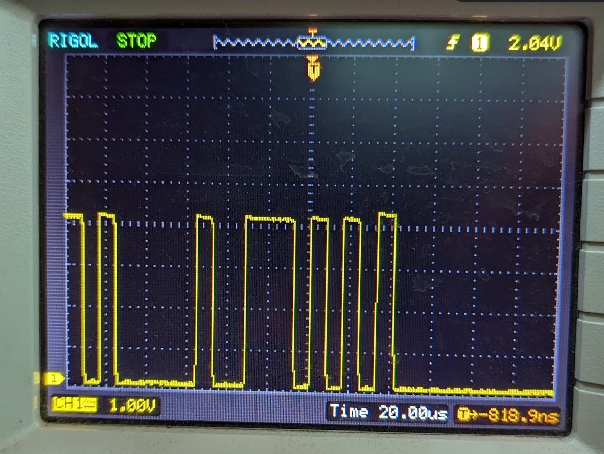
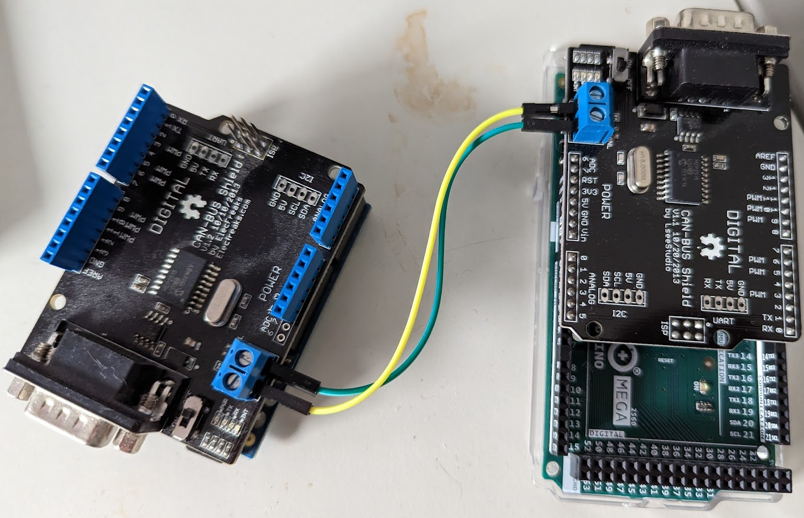
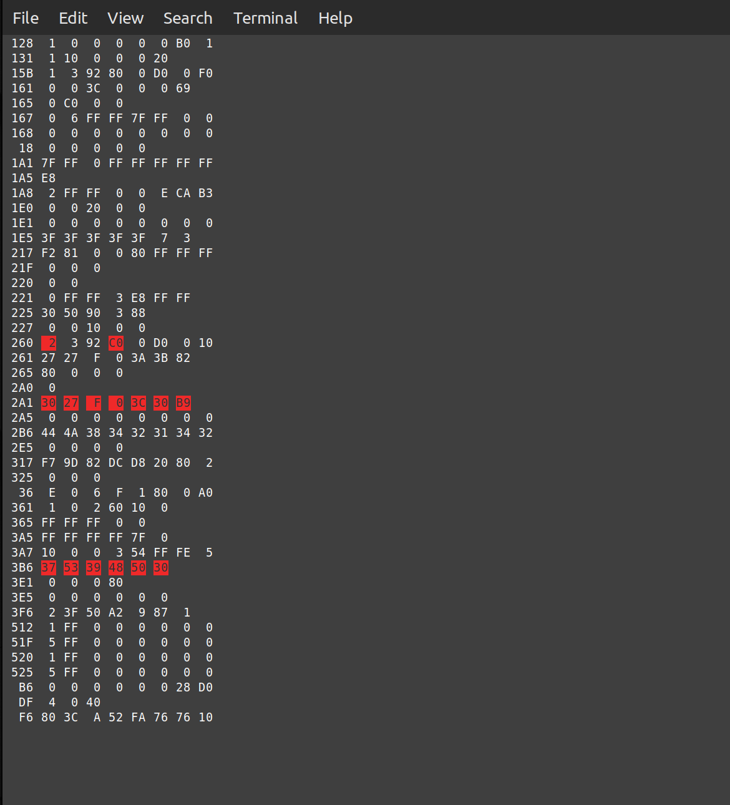

# peugeot-can-bus

## Investigation

At the rear of the Peugeot Partner, behind the left-hand boot panel just above and the rear of the wheel arch can be found a small 18-way 0.1 inch pitch 2x9 connector.



Remove the outer shell to reveal




Viewing the female connector from the underside:

```
yel/green ---  10+-----+ 9  --- yel/green
Pink --------  11|     | 8  --- white
               12|     | 7
               13|     | 6
Red ---------  14|     | 5  --- yellow
               15|     | 4
               16|     | 3
               17|     | 2
               18+-----+ 1
```
   
The connector has numbered pins, but they don't correspond to normal IDC pin numbers.
With the key out of the ignition, the red cable on pin 14 carries approx 11.6 volts.
Once the key is in the ignition and turned (without starting) red switches to around 4.6v
It's at this point that the CAN-BUS signal gets activated.



CAN is carried on Red and Yellow cables.   The Red is normally high, the yellow is normally low when not transmitting.

Therefore Red is CANL
Yellow is CANH.

Having figured out the bus lines, An arduino UNO with older v1.1 shield was used to investigate the data packets.  Shield is wired such that 
default settings of Sandeep Mistry CAN-bus library work out-of-the-box.
https://github.com/sandeepmistry/arduino-CAN/tree/master/examples

Examples work great to join two shields together and allow communication.  In this case I'm using a Mega for the tx side.  There's not much
point in even twisting the wires for such a short distance.



## Optimisation

BUT There's a problem.  To setup effective CAN-bus monitoring, it's necessary to get all CAN packets to the PC.  CAN-bus signalling for my car is 
at 125kbps.  Maximum speed of Arduino UNO serial port is realistically 115200.
Using a line-based serial protocol with hex printed values is nice and easy to decode on the PC side (just seek to newline and decode),
however it's not fast enough to keep up with the data rate.   115,200 is pretty close to 125kbps.  With protocol overhead it should be
possible to keep up on the PC side IF a more efficient protocol is used.

First tried base64 encoding.  It didn't work.  Could have been the speed of the encoding or the transmission efficiency.

Decided to invent my own encoding, trying to use knowledge of the CAN-bus protocol.

### Information that needs to be transmitted to the PC

ID of packet.  This can be 11 bits for standard CAN.  29 bits for extended.
Data of packet.  This cab be zero to eight bytes.

By observation all packets on my vehicle bus appear to be standard.  Whatever protocol I use should optimise standard ID transmission.
Extended doesn't matter so much.
By observation 95% of packets have bits higher than 0xff set.  Therefore no point in optimising sending of id as single byte.
Very few messages have zero bytes sent.  Probably not worth optimising this case.
Many packets set all 8 bytes.

### How I arrived at the protocol

Need to understand where a packet starts and ends.  It's OK if you only know where it ends, and the ending byte has some kind of checksum.
Then you just discard the packets with failing checksums until you get sync.
If you control the data acquisition with a 'START''STOP' command, then you don't need sync because you are ready for the first byte when it 
comes.  Unless the data gets corrupted you're fine.  However this greatly complicates the Arduino side of the software.

BUT... we have very short packets.  Average packet size (for the raw data) is around 11 bits + 6-8 data bytes.  That's about 10 bytes.
What if we simply dedicate one bit (let's say BIT7) to sync, and never use it in the data stream?  7-bits data has some complexity.  You 
have to either wrap transmitted bitstream into 7-bit chunks.  Or you need to take off the top bits and transmit them separately.
BUT... we have 11-bits ID the majority case.  So 11 bits can go in two 7-bit values.  Two bytes to xmit over serial and then we are done.
There's even 'spare' bits (14 - 11 = 3) for any extra info.  So why not use the first of those bits to indicate if the ID is extended, 
and save even more space.

NOW... we come onto the data bytes.  Maximum 8 of them.  We could have some complicated encoding mechanism with bit rotation, but since
max count is 8 why bother?  Simply take off the MS bit for each, and send them to the UART.  Then send another byte which is all the 
bit7s from the 8 preceding bytes in one go.   But for 8-bytes, that byte in turn has too many bits for our 7-bit channel.  So take that 
one off, and add it to the end-of-frame byte.

In order to understand if we started rx mid-frame, the end-of-frame marker must have some information.  At a minimum the number of bytes of 
preceding data.  Since that number of bytes will never be greater than 15 it can be encoded in 4 bits.  So for the end-of-frame marker we
have:

```
BIT7: Sync bit, if set high this is EOF.
BIT6: MSB for the byte carrying all the 'bit7s' of the data bytes.
BIT3-0: Total count of preceding bytes so we know if we have complete frame.
```

BUT... what about extended IDs.  These can be 29 bits.  I don't really have any knowledge of how they are typically used, so I'm not going to
optimise at all.  The bottom 13 bits get sent in the lower 7 bits of the first two transmitted bytes.  Bit6 of the first byte xmitted is
the extended ID indicator.  Remaining bits get rolled into 7-bit chunks in successive 'id' bytes.  So the max bytes to transmit the ID is 5.
However we need to know where the ID stops and the data starts.  So this is done by an 'extra ID bytes' count.  Set to zero for standard
IDs, where the ID is in two bytes, but can be max of 3.

So the marker makeup is:
```
BIT7: Sync bit, if set high this is EOF.
BIT6: MSB for the byte carrying all the 'bit7s' of the data bytes.
BIT5-4: Count of 'extra' id bytes.   
BIT3-0: Total count of preceding bytes so we know if we have complete frame.
```

### Implementation

The monitor program is implemented in Python.  The program aims to draw on the screen only values which change.  I wanted a highlight of 
some sort for values that change, so I can easily spot them on the screen.  When a value changes I want it to change colour, and after some 
period of inactivity (i.e. not changing) I want it to change back.  I set that period at 2 seconds.  A bug in the program means that if there
are no updates to any values, the highlights may not change back, but I can live with that.



The program is in two parts:  The serial listener, which is reading and decoding the CAN packets, and the display element, which receives
only changed packets from a queue, including a 'diff spec' which indicates the particular fields that have changed.  This means it will 
give you the specific byte that changed, instead of telling you about the entire message.

There is no attempt to decode the values at present.  There is not really any attempt to allow scrolling through the values.  If you can't
see all of the IDs arriving on your bus you can change the font size.

### Portability

I aim to write portable software.  First version was using Pyside6, however I realised this is not always easy to get working on 
even Linux, let alone Windows etc....  I subsequently realised this doesn't really need a GUI.  Could be text mode.  So I ported it to 
Urwid.  This is much more straightforward and since it's console, running it as root in case you're too lazy to setup your udev rules 
for /dev/ttyACM0 is easier.  In theory this works on Windows but I haven't tried.

### Testing

Nothing much in software engineering works properly unless it's comprehensively tested.  I can't say I've done this, however I have at least tried
to convince myself that my sketch + Python doesn't lose any packets at the highest rate.  To this end, I've created a transmitter 
sketch which sends back-to-back packets with different IDs.  It goes through the range 0-0x7ff, the maximum standard ID size, and then sends
one extended ID which is a few short of the maximum.  The aim here is just to make sure an extended ID gets picked up.  This sequence is 
predictable, so a receiver can ensure they have captured all packets.  There is a badly named script 'fast_reading.py' for reading the stream
of transmitted packets and printing an error if anything is out of sequence, which would indicate a 'dropped' packet.  After a couple of seconds
stabilising it should stop printing errors.


